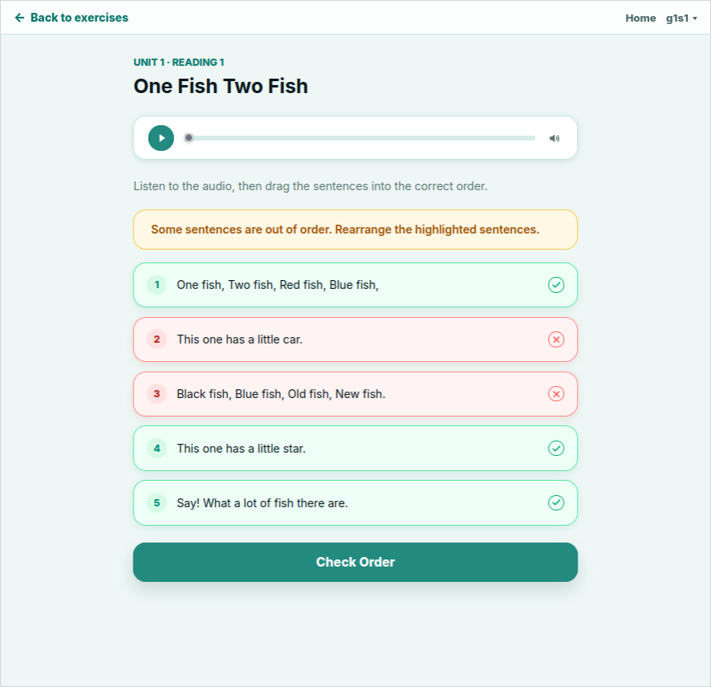
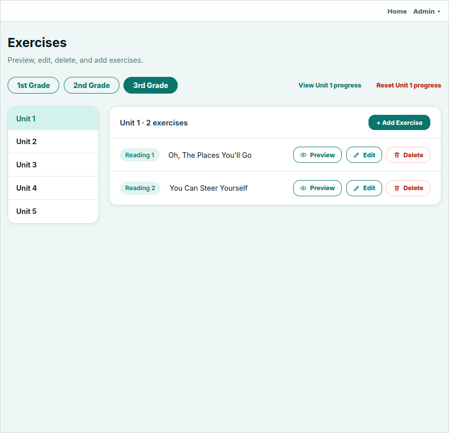
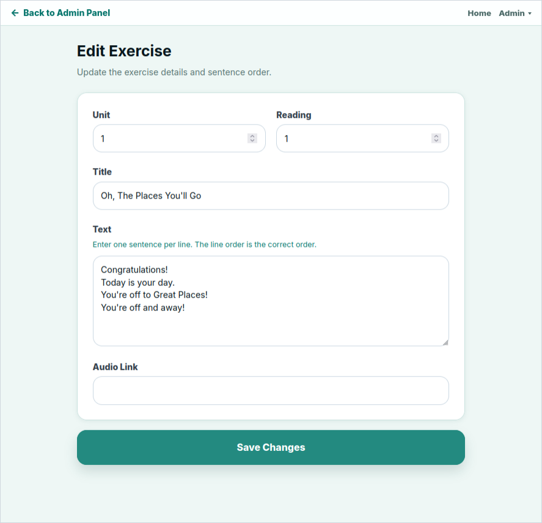
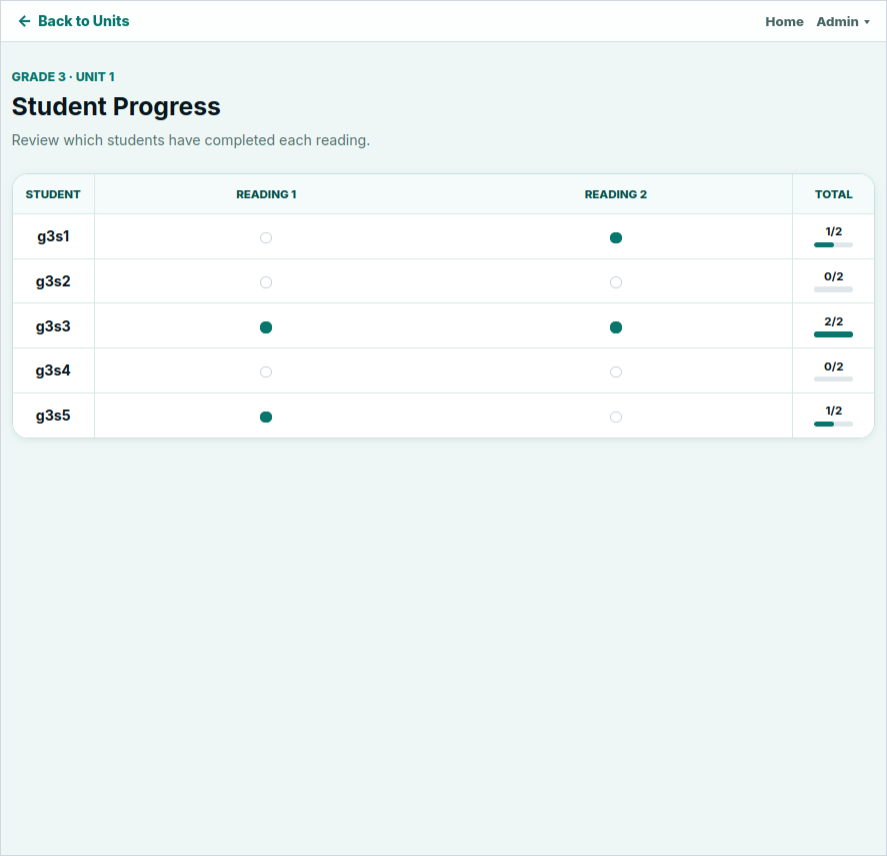

# Sentence Ordering App

A listening/reading practice app created for junior high school students. Students are given shuffled sentences taken from a reading passage and drag them back into the correct order. Teachers can create reading exercises and monitor students' completion progress.

User accounts are pre-seeded for a fixed class roster.

## Live Demo

**[https://sentence-ordering-app.onrender.com](https://sentence-ordering-app.onrender.com)**

The demo is hosted on Render with a Neon PostgreSQL database. It may take a couple of minutes to wake up on the first request. Audio files are hosted externally and linked from each exercise.

The demo uses a seeded database that resets daily at 1:00 PM UTC, so feel free to create, edit, and delete exercises within the live demo.

### Demo Accounts

| Role | Username | Password |
| --- | --- | --- |
| Admin | `admin` | `demo_admin` |
| Grade 1 student | `g1s1` through `g1s5` | `demo_student` |
| Grade 2 student | `g2s1` through `g2s5` | `demo_student` |
| Grade 3 student | `g3s1` through `g3s5` | `demo_student` |

## How It Works

### Student View

Students log in to view the exercise units available for their grade, with each unit containing one or more readings. Completing a reading marks it as done.



### Admin View

Teachers log in to an admin dashboard where they can add, edit, delete, and preview exercises as well as view and reset student completions for each grade and unit.







## Features

- Student users can only view exercises for their assigned grade
- Drag-and-drop sentence ordering
- Audio links for readings
- Correct submissions are saved as completed readings
- Admin tools for creating, previewing, editing, and deleting exercises
- Exercises organized by grade, unit, and reading number
- Progress views by student and reading
- Progress reset controls for admins and students

## Tech Stack

- Java 21, Spring Boot 3.5
- Thymeleaf, Spring Security
- Spring Data JPA, PostgreSQL
- SortableJS
- Docker

## How to Run Locally

### Requirements

- Java 21
- Docker / Docker Compose

### Start PostgreSQL

```bash
docker compose up -d postgres
```

### Run the App

```bash
DDL_AUTO=update ./mvnw spring-boot:run
```

Then open:

```text
http://localhost:8081
```

Local users need to be created in the database with BCrypt password hashes.

## Project Structure

```
src/main/java/com/shorb/sentenceordering/
├── config/          — Spring Security login, roles, and password encoding
├── controller/      — Web routes for home, admin, student, and progress pages
├── exception/       — Application error handling
├── form/            — Form objects and validation
├── model/           — User, exercise, sentence, and completion entities
├── repository/      — Database queries for users, exercises, and completions
└── service/         — Sentence shuffling, answer checking, and progress logic

src/main/resources/
├── static/          — CSS, SortableJS, and exercise interaction scripts
├── templates/       — Thymeleaf views for login, admin, student, and exercise pages
└── application.properties — App configuration

src/test/            — Unit tests and Spring context test
.github/workflows/   — Scheduled demo database reset workflow
compose.yaml         — Local PostgreSQL container
Dockerfile           — App container build
pom.xml              — Maven configuration
mvnw, mvnw.cmd       — Maven wrapper scripts
```
